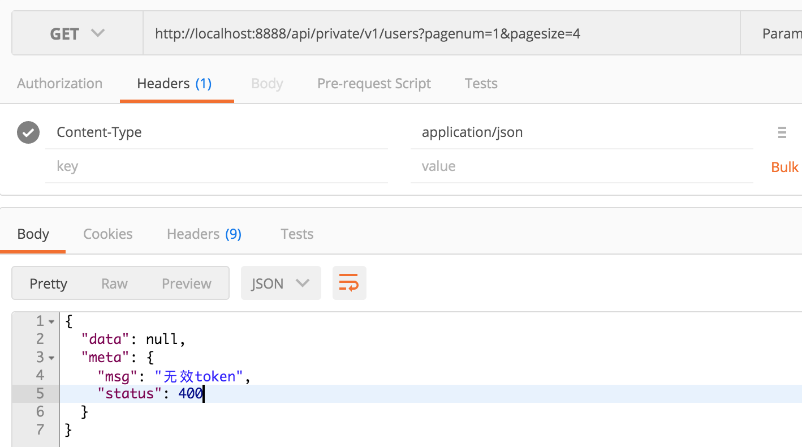
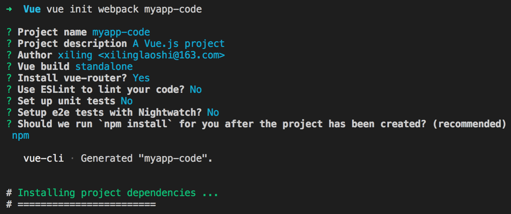
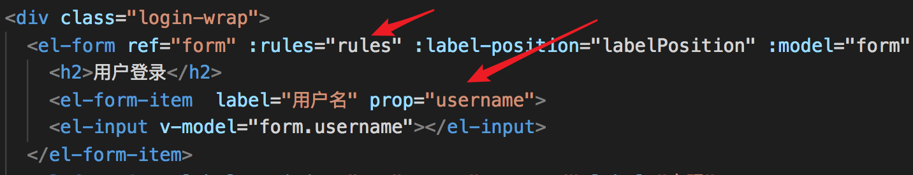

# Vue前后端分离项目

## 第0章 项目如何开始的

### 0.1 总体流程

需求调研-->需求转为需求文档-->将需求文档转为开发文档-->前端文档-->后台文档-->项目测试-->打包上线


### 0.2 数据服务器构建

#### 0.2.1 技术栈

Vue+elementUI+NodeJS+MySQL+windows  协议HTTP

#### 0.2.2 数据服务器准备

根据 \config\default.json 中提供的信息,可知,需要导入数据库数据：

打开数据库服务器，新建名为  `itcast `  的库；

后台为我们提供了 `/api-server/db/mydb.sql` 数据文件，打开复制 sql 语句直接运行即可；

然后在 api-server 中执行 `npm install` 安装服务器所需扩展模块；

`node app.js` 将服务器启动起来;


 ### 0.3  接口测试

#### 0.3.1 登录

后台已经写好接口文档，根据文档中的表述，我们测试登录接口：


#### 0.3.2 获取用户信息

请求用户列表数据；但是，并没有返回相应的数据；




> 使用 token 替换 cookie 的功能


### 0.4 Vue项目初始化

使用 vue-cli 工具初始化项目：




初始化成功，使用 ` npm run dev ` 启动项目；


### 0.5 项目预览

解压 `my-project(Vue项目).rar ` 后进入目录，使用 ` npm run dev ` 启动项目；


## 第1章 开始项目

### 1.1 添加用户登录路由组件

添加路由：`myapp-code/src/router/index.js`

```js
import Vue from 'vue'
import Router from 'vue-router'
import Login from '@/components/login/login'

Vue.use(Router)

export default new Router({
  routes: [
    {
      path:'/login',
      name:'Login',
      component:Login
    }
  ]
})
```


添加组件：`myapp-code/src/components/login/login.vue`

```vue
<template>
  <div>{{msg}}</div>
</template>

<script>
  export default{
    data(){
      return {msg:'我是登录页面'}
    }
  }
</script>
<style>
</style>

```


修改Vue 项目运行端口： myapp-code/config/index.js  


### 1.2 使用 ElementUI

http://element-cn.eleme.io/#/zh-CN


修改 `src/main.js` 代码，全局引入 ElementUI ；

```js
import Vue from 'vue'
import App from './App'
import router from './router'

// 引入 ElementUI 
import ElementUI from 'element-ui'
import 'element-ui/lib/theme-chalk/index.css';
// 将 ElementUI 注册为 vue的全局组件
Vue.use(ElementUI);


Vue.config.productionTip = false

new Vue({
  el: '#app',
  router,
  components: { App },
  template: '<App/>'
})
```


在我们登录页面中尝试一下：` src/components/login/login.vue`

```vue
<template>
  <div>
    <el-button type="success">成功按钮</el-button>
    <el-button type="info">信息按钮</el-button>
    <el-button type="warning">警告按钮</el-button>
    <el-button type="danger">危险按钮</el-button>
  </div>
</template>
```


### 1.3 搭建登录页面

把公共样式写到 `src/assets/css/style.css` ：     ` Form 表单` 

```css
html,
body {
  height: 100%;
}

body {
  margin: 0;
  padding: 0;
}
```

 然后在 `src/main.js` 加载公共样式：

```javascript
// 代码略...

// 引入我们的公共样式
import './assets/css/style.css'

// 代码略...
```

为了让登陆组件的背景色撑满，所以我们需要让他们的父盒子 `div#app` 高度设置为 `100%`。

所以我们在 `src/App.vue` ：

```css
<style>
#app {
  height: 100%;
}
</style>
```

接下来我们开始调整 `src/components/login/login.vue` 组件样式：

- 注意：这里遵循一个原则，不要直接去使用 Element 组件自带的类名
- 如果你想为 Element 组件添加自定义样式，那么建议你给它加你自己的类名来控制


```vue
<template>
<div class="login-wrap">
  <el-form ref="form" :label-position="labelPosition" :model="form" label-width="80px" class="login-from" >
    <h2>用户登录</h2>
    <el-form-item  label="用户名">
    <el-input v-model="form.name"></el-input>
  </el-form-item>
  <el-form-item label-position="top" label="密码">
    <el-input v-model="form.pwd" ></el-input>
  </el-form-item>
  <el-form-item>
    <el-button type="primary" @click="onSubmit" class="login-btn" >登录</el-button>
  </el-form-item>
  </el-form>
  </div>
</template>

<script>
export default {
  data() {
    return {
      labelPosition:'top',
      form: {
        name: "",
        pwd: ""
      }
    };
  },
  methods:{
    onSubmit(){}
  }
};
</script>
```


```css
<style>
.login-wrap {
  background-color: #324152;
  height: 100%;
  display: flex;
  justify-content: center;
  align-items: center;
}

.login-wrap .login-from {
  background-color: #fff;
  width: 400px;
  padding: 30px;
  border-radius: 5px;
}

.login-wrap .login-from .login-btn {
  width: 100%;
}
</style>
```


### 1.4 完成登录功能

#### 1.4.1 封装axios

vue 插件语法： https://cn.vuejs.org/v2/guide/plugins.html

将 axios 进行模块化封装，以 Vue 插件的方式，全局引入：

将插件的封装写入 `src/assets/js/myaxios.js` 

```js
// 引入axios
import Axios from 'axios';
// 自定义插件对象
var myaxios = {};
myaxios.install = function(vue){
  // 设置axios请求的URL，此后axios发送的请求全部执行本地址
  var axios_obj = Axios.create({
    baseURL:'http://localhost:8888/api/private/v1/'
  })
  // 将设置好的axios对象赋值给Vue实例的原型
  // 之后可以在Vue中直接只用 this.$myHttp 使用axios发送请求
  vue.prototype.$myHttp = axios_obj;
}
// 将插件以 模块 方式导出
export default myaxios;

```


在 main.js 引入axios插件，并注册为全局插件

```js
// 导入 myaxios 模块
import myaxios from '@/assets/js/myaxios.js'
Vue.use(myaxios) // 注册使用 axios 插件
```


#### 1.4.2 完成登录功能

**发送post请求**

```js
export default {
  data() {
    return {
      labelPosition:'top',
      form: {
        username: "",
        password: ""
      }
    };
  },
  methods:{
    // 修改组件中绑定的按钮名称为 onLogin 
    onLogin(){
      // 使用axios 发送post 请求，传入data中的form数据
      this.$myHttp.post('login',this.form)
      .then(backdata=>{ // 异步执行成功后
        console.log(backdata);
      });
    }
  }
};
```

**继续修改代码，完成登录逻辑**：

vue-router编程式导航： https://router.vuejs.org/zh/guide/essentials/navigation.html

```js
onLogin(){
    // 使用axios 发送post 请求，传入data中的form数据
    this.$myHttp.post('login',this.form)
        .then(backdata=>{ // 异步执行成功后
        //console.log(backdata.data);
        // 结构赋值，获取返回的数据
        var {data,meta}  = backdata.data;
        // 判断数据状态
        if(meta.status == 200){
            alert('登录成功');
            // 使用vue-router编程式导航跳转到home
            this.$router.push('home');
        }
    });
}
```

 

**修改提示弹窗**

```js
var { data, meta } = backdata.data;
// 判断数据状态
if (meta.status == 200) {
    this.$message({
        message: "恭喜你，登录成功",
        type: "success"
    });
    // 使用vue-router编程式导航跳转到home
    this.$router.push("home");
}else{
    this.$message.error('错了哦');
}
```


#### 1.4.3 表单验证

Form 组件提供了表单验证的功能，只需要通过 `rules` 属性传入约定的验证规则，并将 Form-Item 的 `prop` 属性设置为需校验的字段名即可。

```js
data() {
    return {
      labelPosition: "top",
      form: {
        username: "",
        password: ""
      },
      // 与 el-form 中的 :rules="rules"  对应
      rules: {
        //与 el-form-item 中的 prop="username" 对应
        username: [
          // 验证规则  是否必须        提示信息            触发时机
          { required: true, message: "请输入用户名", trigger: "blur" }
        ],
        password: [
          { required: true, message: "请输入密码", trigger: "blur" },
          { min: 3, max: 5, message: "长度在 3 到 5 个字符", trigger: "blur" }
        ]
      }
    };
  },
```




#### 1.4.4 阻止数据提交

```js
onLogin() {
    // 因为要获取form表单的节点对象，
    // 所以 el-form 中要加入 ref="ruleForm" 
    this.$refs.ruleForm.validate(valid => {
        // elementUI 会将 validate 方法加入到节点对象，
        // 在提交是，如果表单的验证未通过，会将错误信息传入回调函数
        if (!valid) {
            // 如果有表单错误信息，则无反应
            this.$message.error("输入有误");
            return;
        }
        // 使用axios 发送post 请求，传入data中的form数据
        this.$myHttp.post("login", this.form).then(backdata => {
            // 结构赋值，获取返回的数据
            var { data, meta } = backdata.data;
            // 判断数据状态
            if (meta.status == 200) {
                this.$message({
                    message: "恭喜你，登录成功",
                    type: "success"
                });
                // 使用vue-router编程式导航跳转到home
                this.$router.push("home");
            } else {
                this.$message.error("错了哦");
            }
        });
    });
}
```


### 1.5 首页

#### 1.5.1 添加路由及页面布局

修改登录成功后逻辑，使用路由名称表示进行跳转：

```js
// 使用vue-router编程式导航跳转到home
this.$router.push({name:"home"});
```


导入组件，添加路由 `src/router/index.js`

```js
import Home from '@/components/home/home'
 ……
{
    path:'/',
    name:'home',
    component:Home
}
```

添加一个home组件`src/components/home/home.vue`

```vue
<template>
  <div>{{msg}}</div>
</template>

<script>
export default {
  data(){
    return{
      msg:'we'
    }
  }
}
</script>
```


修改一个home组件`src/components/home/home.vue `   ` Container 布局容器`

```vue
<template>
<el-container class="height100">
    <el-header>Header</el-header>
    <el-container>
        <el-aside width="200px">Aside</el-aside>
        <el-main>Main</el-main>
    </el-container>
</el-container>
</template>
```


```css

.height100{
    height: 100%;
}
.el-header {
    background-color: #B3C0D1;
    color: #333;
    text-align: center;
    line-height: 60px;
}
.el-aside {
    background-color: #D3DCE6;
    color: #333;
    text-align: center;
    line-height: 200px;
}
.el-main {
    background-color: #E9EEF3;
    color: #333;
    text-align: center;
    line-height: 160px;
}
```


#### 1.5.2 头部样式

`/src/components/home/home.vue`

`Layout 布局`

```vue
<el-header>
    <el-row>
        <el-col :span="6">
            <div class="grid-content bg-purple">
                 
            </div>
        </el-col>
        <el-col :span="12"><div class="grid-content bg-purple-light">电商后台管理系统</div></el-col>
        <el-col :span="6"><div class="grid-content bg-purple"><el-button type="warning">退出</el-button></div></el-col>
    </el-row>
</el-header>


……
// 标题文本样式
.bg-purple-light {
  font-size: 25px;
  color: white;
}
```


#### 1.5.3 左侧样式

`/src/components/home/home.vue`

` NavMenu 导航菜单`  `Icon 图标`

```vue
 <el-container>
    <el-aside width="200px">
      <!-- 
        el-menu 侧边导航栏组件
			unique-opened="true" 只保持一个导航开启
            router="true" 开启导航路由
        el-submenu 导航栏的顶级项
        template 导航栏中需要展示的内容
            i 图标
            span 文字
        el-menu-item-group 次级导航组 内容与导航的组标识 可直接删除
        el-menu-item  导航栏选项

          index属性 控制收起展开+路由标识:
              在el-menu中加入router=“true”属性;
              index="1-1" 点击时路由跳转到1-1 ;
      -->
      <el-menu 
        :unique-opened="true"
        :router="true" 
        default-active="2"
        class="el-menu-vertical-demo"
        @open="handleOpen"
        @close="handleClose">
        <el-submenu index="1" >
          <template slot="title">
            <i class="el-icon-location"></i>
            <span>用户管理</span>
          </template>
          <el-menu-item index="1-1">
            <i class="el-icon-menu"></i>
            用户列表
          </el-menu-item>
        </el-submenu>

        <el-submenu index="2" >
          <template slot="title">
            <i class="el-icon-location"></i>
            <span>权限管理</span>
          </template>
          <el-menu-item index="2-1">
            <i class="el-icon-menu"></i>
            角色列表
          </el-menu-item>
          <el-menu-item index="2-2">
            <i class="el-icon-menu"></i>
            权限列表
          </el-menu-item>
        </el-submenu>
        
      </el-menu>
    </el-aside>
    <el-main>Main</el-main>
  </el-container>
```


我们发现，大部分组件，在浏览器渲染后，都会在标签内部自动添加一个标签名为名字的 class 属性 ，我们可以利用这个属性，设置样式：

```css
.el-menu{
  width: 200px;
  height: 100%
}

.el-submenu{
    text-align: left;
}
```


#### 1.5.4 右侧内容

添加组件内容 `/src/components/home/home.vue`

```vue
<el-main>
    <!-- 路由组件 -->
    <router-view></router-view>
</el-main>
```


添加组件：`src/components/index.vue`

```vue
<template>
  <p>我是首页内容</p>
</template>

<script>
export default {

}
</script>

<style>

</style>

```

添加路由：`/src/router/index.js`

```js
{
    path:'/index',
    name:'index',
    component:Index
}
```


> 注意: 我们希望index.vue 组件的内容,展示到home组件的 <router-view></router-view>中


**知识补充：**

此时，我们需要借助嵌套路由:  https://router.vuejs.org/zh/guide/essentials/nested-routes.html

嵌套路由(子路由的基本用法)：

```html
<script src="./vue.js"></script>
<script src="./vue-router.js"></script>
<div id="app">
    <router-view></router-view>
</div>
<script>
    // 1:定义路由组件
    var login = {
        template: `
            <div>
                <h2>我是登录页面</h2>
                <li><router-link to="/zi">子路由</router-link></li>
                <!--路由组件中继续使用路由组件-->
                <router-view></router-view>
            </div>
            `
    }
    var zi = {
        template: '<h4>我是嵌套路由的组件</h4>'
    }
    // 2:获取路由对象
    var router = new VueRouter({
        // 定义路由规则
        routes: [
            {
                name: 'login',
                path: "/login",
                component: login,
                // 路由中的 children 属性，定义嵌套路由(子路由)
                children: [
                    { name: 'zi', path: "/zi", component: zi }
                ]
            },
        ]
    })

    var app = new Vue({
        el: '#app',
        router
    })
</script>
```


**再谈 代码加载流程 **

```
(main.js->template: '<App/>')替换 (index.html->div#app);

(index.html-><App/>) --> (components: { App })

( components: { App }) --> (import App from './App' -> src/App.vue)

(App.vue -> <router-view/> -> 路由组件) --> (main.js-> router)
========此项决定了页面展示那个组件内容 ========

({path: '/',name: 'HelloWorld', component: HelloWorld }) --> (import HelloWorld from '@/components/HelloWorld')

(src/components/HelloWorld.vue) --> <router-view/>

```


因此，我们需要让 index 成为 home 的子路由组件 `src/router/index.js`

```js
  routes: [
    {
      path:'/login',
      name:'Login',
      component:Login
    },
    {
      path:'/',
      name:'home',
      component:Home,
      // 添加子路由
      children:[
        {path:'index',name:'index',component:Index}
      ]
    },
  ]
```


登录完成后，跳转到 home-->index  `src/components/login/login.vue`

```js
if (meta.status == 200) {
    this.$message({
        message: "恭喜你，登录成功",
        type: "success"
    });
    // 使用vue-router编程式导航跳转到home->index
    this.$router.push({name:"index"});
}
```


### 1.6 验证首页登录

`src/components/login/login.vue`

```js
if (meta.status == 200) {
    this.$message({
        message: "恭喜你，登录成功",
        type: "success"
    });

    // 登录成功后，将token信息保存到 localStorage 
    window.localStorage.setItem('token',data.token);

    // 使用vue-router编程式导航跳转到home->index
    this.$router.push({name:"index"});
}
```


在 `src/components/home/home.vue` 验证登录

```js
export default {
  // 使用生命周期的钩子函数，判断token
  mounted() {
    // 获取token
    var token = window.localStorage.getItem("token");
    if (!token) {
      // 错误提示
      this.$message.error("请登录");
      // 跳转到登录页面
      this.$router.push({ name: "Login" });
    }
  },

  data() {
    return {
      msg: "we"
    };
  }
};
```


## 第2章 用户管理

### 2.1 路由及组件

`/src/components/home/home.vue`

```vue
 <el-menu-item index="users">
     <i class="el-icon-menu"></i>
     用户列表
</el-menu-item>
```


`src/router/index.js`

```js
import Users from '@/components/users/users'

……

children:[
    {path:'index',name:'index',component:Index},
    {path:'users',name:'users',component:Users}
]
```


`src/components/users/users.vue`

```vue
<template>
  <div>展示用户列表表格</div>
</template>

<script>
export default {

}
</script>

<style>

</style>

```


### 2.2 面包屑导航及搜索框

`src/components/users/users.vue`   `Card 卡片`     `Breadcrumb 面包屑`  `Input 输入框`  ` Button 按钮`

```vue
<template>
<div>
  <!-- 面包鞋 -->
  <el-card>
  <el-breadcrumb separator-class="el-icon-arrow-right">
    <el-breadcrumb-item :to="{ path: '/index' }">首页</el-breadcrumb-item>
    <el-breadcrumb-item>用户管理</el-breadcrumb-item>
    <el-breadcrumb-item>用户列表</el-breadcrumb-item>
  </el-breadcrumb>
</el-card>

</div>
</template>
```


```vue
……
</el-card>

<el-row>
  <el-col :span="6" class="sou">
    <el-input placeholder="请输入内容" v-model="input5" class="input-with-select">
      <el-button slot="append" icon="el-icon-search"></el-button>
    </el-input>
  </el-col>
  <el-col :span="1" class="sou">
      <el-button type="success" plain>添加用户</el-button>
    </el-col>
</el-row>

</div>

……

<script>
export default {
  data(){
    // 不想看到报错
    return{input5:''}
  }
};
</script>

<style>
.sou{
  line-height:30px
}
</style>
```


### 2.3 展示用户列表


.西岭老湿