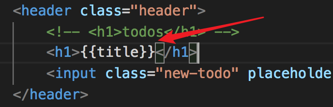
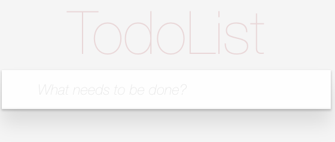

### Vue.js 

> 西岭老湿
>
> 传智播客 & 黑马程序员

----

## 第0章  Vue介绍

### 0.0 开发工程发展历史


通过前面的介绍，我们对目前的项目工程化有了大体了了解，那么其中，在第二阶段的工程化演进中，有一个重要的工程设计理念诞生，他就是著名的 MVC 设计模式，简单点，MVC 其实就是为了项目工程化的一种分工模式；


MVC 中的最大缺点就是单项输入输出，所有的 M 的变化及 V 层的变化，必须通过 C 层调用才能展示；

为了解决相应的问题，出现了 MVVM 的设计思想，简单理解就是实想数据层与展示层的相互调用，降低业务层面的交互逻辑；后面再进行详细介绍；


### 0.1 Vue 介绍

Vue  (读音 /vjuː/，类似于 **view**)  是一套用于构建用户界面的 **渐进式框架**。

注意：Vue是一个框架，相对于 jq 库来说，是由本质区别的；

https://cn.vuejs.org/ 

Vue **不支持** IE8 及以下版本，因为 Vue 使用了 IE8 无法模拟的 ECMAScript 5 特性。但它支持所有[兼容 ECMAScript 5 的浏览器](https://caniuse.com/#feat=es5)。


### 0.2 Vue 初体验

直接下载引入：https://cn.vuejs.org/v2/guide/installation.html

CDN 引入：

```js
<script src="https://cdn.jsdelivr.net/npm/vue@2.5.16/dist/vue.js"></script>
<script src="https://cdnjs.cloudflare.com/ajax/libs/vue/2.5.16/vue.js"></script>
```


CDN 加速： https://www.bootcdn.cn/


```html
<body>
    <div id="div">
        {{user_name}}
    </div>
</body>

// 两种引入方式，任意选择
<script src="https://cdn.jsdelivr.net/npm/vue@2.5.16/dist/vue.js"></script>
<script src="./vue.js"></script>


<script>
    var app = new Vue({
        el:'#div',  // 设置要操作的元素
        // 要替换的额数据
        data:{
            user_name:'我是一个div' 
        }
    })
</script>
```


### 0.3 学习Vue 

基础知识 --> 项目 --> 构建工具 --> Vue其他相关技术


## 第1章 Vue 实例对象

每个 Vue 应用都是通过用 `Vue` 函数创建一个新的 **Vue 实例** 开始的：

```js
var vm = new Vue({
  // 选项
})
```


```html
<body>
    <div id="div">
        {{user_name}}
    </div>
</body>
<script src="./vue.js"></script>
<script>
    var app = new Vue({
        el:'#div',  // 设置要操作的元素
        // 要替换的额数据
        data:{
            user_name:'我是一个div' 
        }
    })
    
    // 打印Vue实例对象
    console.log(app);
</script>
```


通过打印实例对象发现，其中 el 被Vue 放入了公有属性中，而data 则被放入了 私有属性中，而 data 中的数据，需要被外部使用，于是 Vue 直接将data 中的属性及属性值，直接挂载到 Vue 实例中，也就是说，data中的数据，我们可以直接使用 `app.user_name`  直接调用；

```js
var app = new Vue({
    el:'#div',  // 设置要操作的元素
    // 要替换的额数据
    data:{
        user_name:'我是一个div',
        user:222222
    }
})

console.log(app.user_name);
```


 

## 第 2 章 模板语法-插值

我们在前面的代码中，使用 ` {{}} `  的形式在 html 中获取实例对象对象中 data 的属性值；

这种使用 `{{}}`  获取值得方式，叫做  ***插值***  或  ***插值表达式*** ；

### 2.1 文本

数据绑定最常见的形式就是使用“Mustache”语法 (双大括号) 的文本插值：

```html
<span>Message: {{ msg }}</span>
```

Mustache 标签将会被替代为对应数据对象上 `msg` 属性的值。无论何时，绑定的数据对象上 `msg` 属性发生了改变，插值处的内容都会更新。即便数据内容为一段 html 代码，仍然以文本内容展示 

```html
<body>
    <div id="div">
       文本插值 {{html_str}}
    </div>
</body>
<script>
    var app = new Vue({
        el:'#div',
        data:{
            html_str:'<h2>Vue<h2>'
        }
    })
</script>
```

浏览器渲染结果：`<div id="div">文本插值 <h2>Vue<h2></div>`


打开浏览器的 REPL 环境 输入 `app.html_str = '<s>vue</s>'`

随机浏览器渲染结果就会改变： `<div id="div">文本插值 <s>vue</s></div>`


### 2.2 使用 JavaScript 表达式

迄今为止，在我们的模板中，我们一直都只绑定简单的属性键值。但实际上，对于所有的数据绑定，Vue.js 都提供了完全的 JavaScript 表达式支持，但是不能使用 JS 语句；

(表达式是运算，有结果；语句就是代码，可以没有结果)

```html
<body>
    <div id="div" >
       {{ un > 3 ? '大' : '小'}}
       {{ fun() }}
    </div>
</body>
<script>
    var app = new Vue({
        el:'#div',
        data:{
            un:2,
            fun:()=> {return 1+2}
        }
    })
</script>
```


## 第3章 模板语法-指令 

指令 (Directives) 是带有 `v-` 前缀的特殊特性。指令特性的值预期是**单个 JavaScript 表达式** (`v-for` 是例外情况，稍后我们再讨论)。指令的职责是，当表达式的值改变时，将其产生的连带影响，响应式地作用于 DOM；参考  [手册](https://cn.vuejs.org/v2/guide/syntax.html#%E6%8C%87%E4%BB%A4) 、 [API](https://cn.vuejs.org/v2/api/#%E6%8C%87%E4%BB%A4)

```html
<body>
    <div id="div" >
        <p v-if="seen">现在你看到我了</p>
    </div>
</body>
<script>
    var app = new Vue({
        el:'#div',
        data:{
            seen:false
        }
    })
</script>
```


这里，`v-if` 指令将根据表达式 `seen` 的值的真假来插入/移除 `<p>` 元素。


### 3.1 v-text / v-html 文本

https://cn.vuejs.org/v2/api/#v-text

https://cn.vuejs.org/v2/api/#v-html


```html
//这个代码是错误的，
<body>
    <div id="div" {{class}}>
        <p v-text="seen"></p>
        <p v-html="str_html"></p>
    </div>
</body>
<script>
    var app = new Vue({
        el:'#div',
        data:{
            seen:'<h1>Vue</h1>',
            str_html:'<h1>Vue</h1>',
            class:'dd',
        }
    })
</script>
```


> 注意：
>
> - v-text
>   - v-text和差值表达式的区别
>     - v-text 标签的指令更新整个标签中的内容(替换整个标签包括标签自身)
>     - 差值表达式，可以更新标签中局部的内容
> - v-html
>   - 可以渲染内容中的HTML标签
>   - 尽量避免使用，否则会带来危险(XSS攻击 跨站脚本攻击)

**HTML 属性不能用 `{{}}` 语法**


### 3.2 v-bind 属性绑定

https://cn.vuejs.org/v2/api/#v-bind

可以绑定标签上的任何属性。

**动态绑定图片的路径**

```html

<script>
    var vm = new Vue({
        el: '#app',
        data: {
            src: '1.jpg'
        }
    });
</script>
```


**绑定a标签上的id**

```html
<a id="app" v-bind:href="'del.php?id=' + id">删除</a>
<script>
	var vm = new Vue({
        el: '#app',
        data: {
            id: 11
        }
    });
</script>
```


**绑定class**

对象语法和数组语法

- 对象语法

  如果isActive为true，则返回的结果为 `<div id="app" class="active"></div>`

  ```html
  <div id="app" v-bind:class="{active: isActive}">
      hei
  </div>
  <script>
      var vm = new Vue({
          el: '#app',
          data: {
              isActive: true
          }
      });
  </script>
  ```

- 数组语法

  渲染的结果： `<div id="app" class="active text-danger"></div>`

  ```html
  <div id="app" v-bind:class="[activeClass, dangerClass]">
      hei
  </div>
  <script>
      var vm = new Vue({
          el: '#app',
          data: {
              activeClass: 'active',
              dangerClass: 'text-danger'
          }
      });
  </script>
  ```

**绑定style**

对象语法和数组语法

- 对象语法

  渲染的结果： `<div id="app" style="color: red; font-size: 40px;">hei</div>`

  ```html
  <div id="app" v-bind:style="{color: redColor, fontSize: font + 'px'}">
      hei
  </div>
  <script>
      var vm = new Vue({
          el: '#app',
          data: {
              redColor: 'red',
              font: 40
          }
      });
  </script>
  ```

- 数组语法 

  渲染结果：`<div id="app" style="color: red; font-size: 18px;">abc</div>`


  ```html
  <div id="app" v-bind:style="[color, fontSize]">abc</div>
  <script>
      var vm = new Vue({
          el: '#app',
          data: {
              color: {
                  color: 'red'
              },
              fontSize: {
                  'font-size': '18px'
              }
          }
      });
  </script>
  ```


**简化语法**

```html
<div id="app">
    
    <!-- 缩写 --> 
    
</div>

<script>
    var vm = new Vue({
        el: '#app',
        data: {
            imageSrc: '1.jpg',
        }
    });
</script>
```


### 3.3 v-model 双向数据绑定

https://cn.vuejs.org/v2/api/#v-model

**单向数据绑定**

```html
<div id="div">
    <input type="text" :value="input_val">
</div>

<script>
    var app = new Vue({
        el: '#div',
        data: {
            input_val: 'hello world '
        }
    })
</script>
```

浏览器渲染结果： `<div id="div"><input type="text" value="hello world"></div>`


通过浏览器 REPL 环境可以进行修改 `app.input_val = 'Vue'`  

浏览器渲染结果： `<div id="div"><input type="text" value="Vue"></div>`


我们通过 vue 对象修改数据可以直接影响到 DOM 元素，但是，如果直接修改 DOM 元素，却不会影响到 vue 对象的数据；我们把这种现象称为 ***单向数据绑定***  ；


**双向数据绑定**

```html
<div id="div">
    <input type="text" v-model="input_val" >
</div>

<script>
    var app = new Vue({
        el: '#div',
        data: {
            input_val: 'hello world '
        }
    })
</script>
```

通过 v-model 指令展示表单数据，此时就完成了 ***双向数据绑定***  ；

不管 DOM 元素还是 vue 对象，数据的改变都会影响到另一个；


**多行文本 / 文本域**

```html
<div id="div">
    <textarea v-model="inp_val"></textarea>
    <div>{{ inp_val }}</div>
</div>

<script>
    var app = new Vue({
        el: '#div',
        data: {
            inp_val: ''
        }
    })
</script>
```


**绑定复选框**

```html
<div id="div">
    吃饭：<input type="checkbox" value="eat" v-model="checklist"><br>
    睡觉：<input type="checkbox" value="sleep" v-model="checklist"><br>
    打豆豆：<input type="checkbox" value="ddd" v-model="checklist"><br>
    {{ checklist }}
</div>

<script>
    var vm = new Vue({
       el: '#div',
        data: {
            checklist: ''
            // checklist: []
        }
    });
</script>
```


**绑定单选框**

```html
<div id="app">
    男<input type="radio" name="sex" value="男" v-model="sex">
    女<input type="radio" name="sex" value="女" v-model="sex"> 
    <br>
    {{sex}}
</div>

<script>
    var vm = new Vue({
        el: '#app',
        data: {
            sex: ''
        }
    });
</script>
```


**修饰符**

[`.lazy`](https://cn.vuejs.org/v2/guide/forms.html#lazy) - 取代 `input` 监听 `change` 事件

[`.number`](https://cn.vuejs.org/v2/guide/forms.html#number) - 输入字符串转为有效的数字

[`.trim`](https://cn.vuejs.org/v2/guide/forms.html#trim) - 输入首尾空格过滤

```html
<div id="div">
    <input type="text" v-model.lazy="input_val">
    {{input_val}}
</div>

<script>
    var app = new Vue({
        el: '#div',
        data: {
            input_val: 'hello world '
        }
    })
</script>
```


### 3.4 v-on 绑定事件监听

https://cn.vuejs.org/v2/api/#v-on

https://cn.vuejs.org/v2/guide/events.html


#### 3.4.1 基本使用

```html
<div id="app">
    <input type="button" value="按钮" v-on:click="cli">
</div>
<script>
    var vm = new Vue({
        el: '#app',
        data: {
            cli:function(){
                alert('123');
            }
        }
    });
</script>
```

上面的代码运行是没有问题的，但是，我们不建议这样做，因为 data 是专门提供数据的对象，事件触发需要执行的是一段代码，需要的是一个方法 (事件处理程序) ；

修改代码如下：

```html
<div id="app">
    <!-- 使用事件绑定的简写形式 -->
    <input type="button" value="按钮" @click="cli">
</div>
<script>
    var vm = new Vue({
        el: '#app',
        data: {},
        // 将事件处理程序写入methods对象
        methods: {
            cli: function () {
                alert('123');
            }
        }
    });
</script>
```


**向事件处理器中传参**

```html
<div id="app">
    <!-- 直接调用传参即可 -->
    <input type="button" value="按钮" @click="cli(1,3)">
</div>
<script>
    var vm = new Vue({
        el: '#app',
        data: {},
        methods: {
            // 接受参数
            cli: function (a,b) {
                alert(a+b);
            }
        }
    });
</script>
```

而此时，如果在处理器中需要使用事件对象，则无法获取，我们可以用特殊变量 `$event` 把它传入方法

`<input type="button" value="按钮" @click="cli(1,3,$event)">`

```js
methods: {
    // 接受参数
    cli: function (a,b,ev) {
        alert(a+b);
        console.log(ev);
    }
}
```


#### 3.4.2 事件修饰符

原生 JS 代码，想要阻止浏览器的默认行为(a标签跳转、submit提交)，我们要使用事件对象的  `preventDefault()` 方法

```html
<div id="app">
    <a href="http://www.qq.com" id="a">腾百万</a>
</div>
<script>
    document.getElementById('a').onclick = (ev)=>{
        // 组织浏览器的默认行为
        ev.preventDefault();
    }
</script>
```


使用修饰符 阻止浏览器的默认行为 

```html
<div id="app">
    <a href="http://www.qq.com" @click.prevent="cli">腾百万</a>
</div>
<script>
    var vm = new Vue({
        el: '#app',
        data: {},
        // 将事件处理程序写入methods对象
        methods: {
            cli: function () {
                alert('123');
            }
        }
    });
</script>
```


使用修饰符绑定一次性事件

```html
<div id="app">
    <a href="http://www.qq.com" @click.once="cli($event)">腾百万</a>
</div>
<script>
    var vm = new Vue({
        el: '#app',
        data: {},
        // 将事件处理程序写入methods对象
        methods: {
            cli: function (ev) {
                ev.preventDefault();
                alert('123');
            }
        }
    });
</script>
```


#### 3.4.3 按键修饰符

绑定键盘抬起事件，但是只有`enter` 键能触发此事件

```html
<div id="app">
    <input type="text"  @keyup.enter="keyup">
</div>
<script>
    var vm = new Vue({
        el: '#app',
        data: {},
        methods: {
            keyup:()=>{
                console.log('111')
            }
        }
    });
</script>
```


#### 3.4.4 系统修饰符

按住 `shift` 后才能触发点击事件

```html
<div id="app">
    <input type="button" value="按钮" @click.shift="cli">
</div>
<script>
    var vm = new Vue({
        el: '#app',
        data: {},
        methods: {
            cli:()=>{
                console.log('111')
            }
        }
    });
</script>
```


#### 3.4.5 鼠标修饰符

鼠标中键触发事件

```html
<div id="app">
    <input type="button" value="按钮" @click.middle="cli">
</div>
<script>
    var vm = new Vue({
        el: '#app',
        data: {},
        methods: {
            cli:()=>{
                console.log('111')
            }
        }
    });
</script>
```


#### 3.4.6 为什么在 HTML 中监听事件?

> 你可能注意到这种事件监听的方式违背了关注点分离 (separation of concern) 这个长期以来的优良传统。但不必担心，因为所有的 Vue.js 事件处理方法和表达式都严格绑定在当前视图的 ViewModel 上，它不会导致任何维护上的困难。实际上，使用 `v-on` 有几个好处：
>
> 1. 扫一眼 HTML 模板便能轻松定位在 JavaScript 代码里对应的方法。
> 2. 因为你无须在 JavaScript 里手动绑定事件，你的 ViewModel 代码可以是非常纯粹的逻辑，和 DOM 完全解耦，更易于测试。
> 3. 当一个 ViewModel 被销毁时，所有的事件处理器都会自动被删除。你无须担心如何清理它们。


### 3.5 v-show 显示隐藏

https://cn.vuejs.org/v2/api/#v-show

根据表达式之真假值，切换元素的 `display` CSS 属性。

```html
<div id="app">
    <p v-show="is_show">Vue</p>
</div>
<script>
    var vm = new Vue({
        el:'#app',
        data:{
            is_show:false
        },
        methods:{},
    })
</script>
```


案例：点击按钮切换隐藏显示

```html
<div id="app">
    <input type="button" value="按钮" @click="isshow">
    <p v-show="is_show">Vue</p>
</div>
<script>
    var vm = new Vue({
        el:'#app',
        data:{
            is_show:false
        },
        methods:{
            isshow:function(){
                this.is_show = !this.is_show;
            }
        },
    })
</script>
```


### 3.6 v-if / v-else / v-else-if 条件判断

https://cn.vuejs.org/v2/api/#v-if

```html
<div id="app">
    <div v-if="type === 'A'">
        A
    </div>
    <div v-else-if="type === 'B'">
        B
    </div>
    <div v-else-if="type === 'C'">
        C
    </div>
    <div v-else>
        Not A/B/C
    </div>
</div>
<script>
    var vm = new Vue({
        el: '#app',
        data: {
            type: 'F'
        },
    })
</script>
```


### 3.7 v-for 循环

https://cn.vuejs.org/v2/api/#v-for

```html
<div id="app">
    <ul>
        <li v-for="(val,key) in arr">{{val}}---{{key}}</li>
    </ul>
    <ul>
        <li v-for="(val,key) in obj">{{val}}---{{key}}</li>
    </ul>
</div>
<script>
    var vm = new Vue({
        el: '#app',
        data: {
            arr: ['a', 'b', 'c'],
            obj: { id: 1, name: '李四' }
        },
    })
</script>
```


### 3.8 v-cloak 

https://cn.vuejs.org/v2/api/#v-cloak

和 CSS 规则如 `[v-cloak] { display: none }` 一起用时，这个指令可以隐藏未编译的 Mustache 标签直到实例准备完毕。


```html
<div id="app">
    <p>{{obj.id}}</p>
</div>
<script src="./vue.js"></script>
<script>
    setTimeout(() => {
        var vm = new Vue({
            el: '#app',
            data: {
                arr: ['a', 'b', 'c'],
                obj: { id: 1, name: '李四' }
            },
        })
    }, 2000);
</script>
```

当我们的网络受阻时，或者页面加载完毕而没有初始化得到 vue 实例时，DOM中的 `{{}}` 则会展示出来；

为了防止现象，我们可以使用 CSS 配合 v-cloak 实现获取 VUE 实例前的隐藏；

```html
<style>
    [v-cloak] {
        display: none;
    }
</style>
<div id="app">
    <p v-cloak>{{obj.id}}</p>
</div>
<script src="./vue.js"></script>
<script>
    setTimeout(() => {
        var vm = new Vue({
            el: '#app',
            data: {
                obj: { id: 1, name: '李四' }
            },
        })
    }, 2000);
</script>
```


### 3.9 v-once

https://cn.vuejs.org/v2/api/#v-once

只渲染元素和组件**一次**。随后的重新渲染，元素/组件及其所有的子节点将被视为静态内容并跳过

```html
<div id="app">
    <p v-once>{{msg}}</p>
</div>
<script>
    var vm = new Vue({
        el: '#app',
        data: {
            msg:'kkk'
        },
    })
</script>
```


## 第4章 TodoList 案例

上市产品： [ToDoList](http://www.todolist.cn/) 、[奇妙清单](https://www.wunderlist.com/zh/) 、[滴答清单](https://www.dida365.com/)

学习练手项目 ： [TodoMVC](http://todomvc.com/)  、 [Vue官方示例](https://cn.vuejs.org/v2/examples/todomvc.html)

为什么选择这样的案例：

产品功能简洁，需求明确，所需知识点丰富；实现基本功能容易，涵盖所学基础知识；而可扩展性强，完善所有功能比较复杂，所需技术众多；在学习中，可以灵活取舍；


### 4.1 项目初始化

在项目目录中执行  `npm install ` 命令，下载所需静态资源 ; 将Vue.js框架代码，复制到 js 目录，在index.html中引入 vue  :   `<script src="./js/vue.js"></script>`

同时 在 index.html 最下方，项目引入了app.js ; 而我们要写的 vuejs 代码，都放在这个文件中；





### 4.2 数据遍历

```js
const list_data = [
    {id:1,title:'吃饭',stat:true},
    {id:2,title:'睡觉',stat:false},
    {id:3,title:'打豆豆',stat:true},
]

new Vue({
    el:'#todoapp',
    data:{
        // list_data:list_data,
        list_data,// es6属性简写
    }
})
```


```html
<ul class="todo-list">
    <li v-for="(val,key) in list_data">
        <div class="view">
            <input class="toggle" type="checkbox" v-model="val.stat">
            <label>{{val.title}}</label>
            <button class="destroy"></button>
        </div>
        <input class="edit" value="Rule the web">
    </li>
</ul>
```


### 4.3 展示无数据状态




标签及内容都是在 section footer 两个标签中的，当 list_data 中没有数据时，我们只需要隐藏这个两个标签即可：

```html
<section v-if="list_data.length" class="main">
……
</section>
<footer v-if="list_data.length" class="footer"> 
……
</footer>
```


两个标签都有 `v-if` 判断 ，因此我们可以使用一个 `div` 包裹两个标签，使 `div`  隐藏即可：

```html
<div v-if="list_data.length">
    <section  class="main">
    ……
    </section>
    <footer  class="footer"> 
    ……
    </footer>
</div>
```


如果有内容，那么 DOM 书中就会多出一个 div 标签，那么我们可以选择使用 `template` (vue中的模板标识)，有内容时，浏览器渲染不会有此节点；

```html
<template v-if="list_data.length">
    <section  class="main">
    ……
    </section>
    <footer  class="footer"> 
    ……
    </footer>
</template>
```


### 4.3 添加任务

绑定 `enter` 键盘事件:

```html
<input @keyup.enter="addTodo" class="new-todo" placeholder="请输入" autofocus>
```


```js
new Vue({
    el:'#todoapp',
    data:{
        // list_data:list_data,
        list_data,// es6属性简写
    },
	//添加事件处理器    
    methods:{
        // addTodo:function(){}
        // 简写形式
        addTodo(){
            console.log(123);
        }
    }
})
```


修改代码完成任务添加：

```js
methods: {
    // addTodo:function(){}
    // 简写形式
    addTodo(ev) {
        // 获取当前触发事件的元素
        var inputs = ev.target;
        // 获取value值，去除空白后判断，如果为空，则不添加任务
        if (inputs.value.trim() == '') {
            return;
        }
        // 组装任务数据
        var todo_data = {
            id: this.list_data.length + 1 + 1,
            title: inputs.value,
            stat: false
        };
        // 将数据添加进数组
        this.list_data.push(todo_data);
        // 清空文本框内容
        inputs.value = '';
    }
}
```


### 4.4 任务的全选与反选

点击文本框左边的下箭头，实现全选和反选操作

为元素绑定点击事件：

```html
<input @click="toggleAll" id="toggle-all" class="toggle-all" type="checkbox">
```


添加处理程序：

```js
toggleAll(ev){
   // 获取点击的元素 
    var inputs = ev.target;
    // console.log(inputs.checked);
    // 循环所有数据为状态重新赋值
    // 因为每个元素的选中状态都是使用 v-model 的双向数据绑定，
    // 因此 数据发生改变，状态即改变，状态改变，数据也会改变
    for(let i=0;i<this.list_data.length;i++){
        this.list_data[i].stat = inputs.checked;
    }
}
```


### 4.5 完成任务

如果任务完成，状态改为选中， `li`  的 `class` 属性为 `completed`  时文字有中划线；

```html
<li v-for="(val,key) in list_data" v-bind:class="{completed:val.stat}">
```


### 4.6 删除任务

绑定点击事件，将当前索引值传入事件处理程序：

```html
<button @click="removeTodo(key)" class="destroy"></button>
```


按照索引，删除相应的数据：

```js
removeTodo(key){
    this.list_data.splice(key,1);
},
```


### 4.7 删除已完成的任务

绑定事件

```html
<button @click="removeAllDone" class="clear-completed">Clear completed</button>
```


循环遍历所有数据，删除已被标记为完成的任务：

```js
removeAllDone(){
    for(let i=0;i<list_data.length;i++){
        if(list_data[i].stat == true){
            this.list_data.splice(i,1);
        }
    }
}
```


循环的代码看起来很不舒服, **`Array.prototype.filter() `** 方法创建一个新数组, 其包含通过所提供函数实现的测试的所有元素。

```js
var arr = [1,4,6,2,78,23,7,3,8];
// 原始写法
// var new_arr = arr.filter(function(v){
//     // if(v>8){
//     //     return true;
//     // }
//     return v>8;
// })

// 箭头函数写法
// var new_arr = arr.filter((v)=>{
//     return v>8;
// })

// 精简写法
var new_arr = arr.filter((v)=> v>8);

console.log(new_arr);
```


修改项目代码：

```js
removeAllDone(){
    // 原始循环判断用法
    // for(let i=0;i<list_data.length;i++){
    // 	if(list_data[i].stat == true){
    // 		this.list_data.splice(i,1);
    // 	}
    // }
	
    // 上面是循环删除符合条件的数据
    // 下面是保留不符合条件的数据
    
    // 原始标准库对象方法
    // this.list_data = this.list_data.filter(function(v){
    // 	if(v.stat == false){
    // 		return true;
    // 	}
    // })
	
    // 箭头函数方法
    // this.list_data = this.list_data.filter(function(v){
    // 	return !v.stat;
    // })
	
    // 精简方法
    this.list_data = this.list_data.filter((v)=>!v.stat);
},
```


TodoList案例暂时告一段落，我们并没有将产品做完，因为我们需要用到其他知识了；


> ##### [Vue Devtools](https://cn.vuejs.org/v2/guide/installation.html#Vue-Devtools) 调试工具
>
> 在使用 Vue 时，我们推荐在你的浏览器上安装 [Vue Devtools](https://github.com/vuejs/vue-devtools#vue-devtools)。它允许你在一个更友好的界面中审查和调试 Vue 应用。


## 第5章 MVVM设计思想

**MVC 设计思想：**

M: model 数据模型层  提供数据

V: Views 视图层      渲染数据

C: controller 控制层 调用数据渲染视图


**MVVM 设计思想：**

M: model 数据模型层  提供数据

V: Views 视图层      渲染数据

VM：ViewsModel 视图模型层   调用数据渲染视图

​	由数据来驱动视图（不需要过多考虑dom操作，把重心放在VM）


### 计算属性

```html
<div id="div">
    <input type="text" v-model="xing">
    <input type="text" v-model="ming">
    {{xing + ming}}
</div>

<script>
    var app = new Vue({
        el: '#div',
        data: {
            xing:'',
            ming:'',
        }
    })
</script>
```

模板内的表达式非常便利，但是设计它们的初衷是用于简单运算的。在模板中放入太多的逻辑会让模板过重且难以维护。因此我们可以使用方法，来进行运算并返回数据：

```html
<div id="div">
    <input type="text" v-model="xing">
    <input type="text" v-model="ming">
    {{ fullname() }} 
    <!-- 一百次调用，观察时间结果-->
    {{ fullname() }} 
</div>

<script>
    var app = new Vue({
        el: '#div',
        data: {
            xing:'',
            ming:'',
        },
        methods:{
            fullname(){
                return this.xing+this.ming;
            }
        }
    })
</script>
```

注意，每次在模板中使用 `{{ fullname() }}` fullname方法就会被调用执行一次；所以，对于任何复杂逻辑，你都应当使用**计算属性** ，因为计算属性，会自动缓存数据：

```html
<div id="div">
    <input type="text" v-model="xing">
    <input type="text" v-model="ming">
    <br>
    {{fulln}}
    <!-- 一百次调用 -->
    {{fulln}}
</div>

<script>
    var app = new Vue({
        el: '#div',
        data: {
            xing:'',
            ming:'',
        },
        computed:{
            fulln(){
                return this.xing+this.ming+Date.now();
            }
        }
    })
</script>
```


我们可以将同一函数定义为一个方法而不是一个计算属性。两种方式的最终结果确实是完全相同的。然而，不同的是**计算属性是基于它们的依赖进行缓存的**。只在相关依赖发生改变时它们才会重新求值；多次调用，计算属性会立即返回之前的计算结果，而不必再次执行函数。


### 过滤器


> 本文档大量参考相关书籍、文档、博客、手册等资源，最终解释权归 [**西岭老湿**](https://zhuanlan.zhihu.com/xilinglaoshi) 个人所有；
>
>
>
> 参考资源相关列表:
>
> https://cn.vuejs.org/   Vue.js 官方网站
>
>


