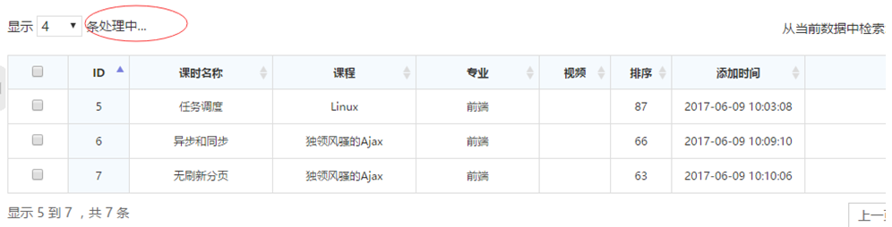

# datatables 使用

## 一、简介

> 官网：<https://datatables.net/>
> 中文官网：http://datatables.club/

Datatables是一款`jquery`表格插件。它是一个高度灵活的工具，可以将任何HTML表格添加高级的交互功能。

- 分页，即时搜索和排序
- 几乎支持任何数据源：DOM， javascript， Ajax 和 服务器处理
- 支持不同主题 DataTables, jQuery UI, Bootstrap, Foundation
- 各式各样的扩展: Editor, TableTools, FixedColumns ……
- 丰富多样的option和强大的API
- 支持国际化
- 超过2900+个单元测试
- 免费开源 


## 二、使用

### 1、引入相关js和css文件

```html
<!-- DataTables CSS -->
<link rel="stylesheet" type="text/css" href="http://cdn.datatables.net/1.10.15/css/jquery.dataTables.css">
<!-- jQuery -->
<script type="text/javascript" charset="utf8" src="http://code.jquery.com/jquery-1.10.2.min.js"></script>
<!-- DataTables -->
<script type="text/javascript" charset="utf8" src="http://cdn.datatables.net/1.10.15/js/jquery.dataTables.js"></script>
```


### 2、添加HTML代码

```html
<table id="table_id_example" class="display">
    <thead>
        <tr>
            <th>Column 1</th>
            <th>Column 2</th>
        </tr>
    </thead>
    <tbody>
        <tr>
            <td>Row 1 Data 1</td>
            <td>Row 1 Data 2</td>
        </tr>
        <tr>
            <td>Row 2 Data 1</td>
            <td>Row 2 Data 2</td>
        </tr>
    </tbody>
</table>
```

### 3、初始化Datatables

```js
$(document).ready( function () {
    $('#table_id_example').DataTable();
} );
```

### 4、效果


## 三、常用选项

### order  

> 应用于表的初始顺序（排序） 

```js
# 参数1 列索引按顺序排列 从0开始 
# 参数2 排序的规则
"order": [[ 1, "asc/desc" ],...]
```


### stateSave 
> 状态保存 - 页面重新加载时恢复表状态
> 启用或禁用状态保存。启用后，DataTables将存储状态信息，例如分页位置，显示长度，过滤和排序。当最终用户重新加载页面时，表的状态将被更改以匹配他们之前设置的状态。 
```js
# 默认值 false
stateSave: true/false
```
### columnDefs  
> 设置列定义初始化属性
> 此参数允许您为表中的列指定特定选项，但在这种情况下，定义的列选项可应用于一个或多个列 
```js
columnDefs:[
    # 索引0列和第8列，不进行排序
    {targets:[0,8],orderable:false}
]
```


### lengthMenu
> 定义在每页显示记录数的select中显示的选项
```js
$('#example').DataTable({
  "lengthMenu": [ 10, 25, 50, 75, 100 ]
});
# 或
$('#example').DataTable({
  "lengthMenu": [ [10, 25, 50, -1], [10, 25, 50, "所有"] ]
});
```

### paging
> 是否允许表格分页  true/false
>
> 默认：true


### info

> 控制是否显示表格的信息   true/false
>
> 默认：true


### searching

> 是否允许Datatables开启本地搜索 true/false
>
> 默认：true


### ordering

> 是否允许Datatables开启排序 true/false
>
> 默认：true


### processing

> 是否显示正在处理的状态 true/false
>
> 默认：false



## 四、Ajax使用远程数据

> 有时从DOM读取数据太慢或太笨重，特别是在处理数千或数百万个数据行时。为了解决这个问题，DataTables的服务器端处理功能提供了一种方法，可以让服务器端的数据库引擎完成所有“繁重的工作” 。
>
> 当使用服务器端处理时，DataTables将在页面上每次绘制信息时向服务器发出Ajax请求（即，在分页，排序，搜索等时）。DataTables将向服务器发送许多变量，以允许它执行所需的处理，然后以DataTables所需的格式返回数据。 

### 1、客户端

```js
$('#example').DataTable( {
    // 开启服务器模式
    serverSide: true,
    // ajax发起请求
    ajax: {
            // 请求地址
            url: '/data-source',
            // 请求方式 get/post
            type: 'POST',
            // 头信信息 laravel post请求时 csrf
            headers: { 'X-CSRF-TOKEN' : '{{ csrf_token() }}' },
            // 请求的参数
            data: {
                "user_id": 451
            },
            /*
            // 两者写法效果一致  但是它用于搜索
            data: function ( d ) {
                d.user_id = $('#user_id').val();
            }
            */
        },
        // columns要对tr中的td单元格中的内容进行数据填充
        // 注意：如果data接收类似a或b的信息，实际服务器没有返回该信息，那么一定要同时设置defaultContent属性，否则报错
        columns: [
            // 总的数量与表格的列的数量一致，不多也不少
            // 字段名称与sql查询出来的字段时要保持一致，就是服务器返回数据对应的字段名称
            // defaultContent 和 className 可选参数
            {'data':'字段名称1',"defaultContent": "默认值",'className':'类名'},
            {'data':'字段名称n',"defaultContent": "默认值",'className':'类名'}
        ],
        /*
        创建tr/td时的回调函数，可以继续修改、优化tr/td的显示，里边有遍历效果，会依次扫描生成的每个tr
        row:创建好的tr的dom对象
        data:数据源，代表服务器端返回的每条记录的实体信息
        dataIndex:数据源的索引号码
        */
        createdRow:function(row,data,dataIndex){}
    
} );
```

### 2、服务端

```php
/*
draw: 客户端调用服务器端次数标识
recordsTotal: 获取数据记录总条数
recordsFiltered: 数据过滤后的总数量
data: 获得的具体数据
注意：recordsTotal和recordsFiltered都设置为记录的总条数
*/
$result = [
   'draw' 		 	 => $request->get('draw'),
   'recordsTotal' 	 => $count,
   'recordsFiltered' => $count,
   'data'			=> $data
];
return json_encode($result);
```

### 3、搜索

> datatable对象.api().ajax.reload()
>
> 重新加载数据 

```php
var table = $('#example').DataTable( {
    ajax: "data.json"
} );
 
$('#search').on('click',function(){
    table.api().ajax.reload();
});
```


